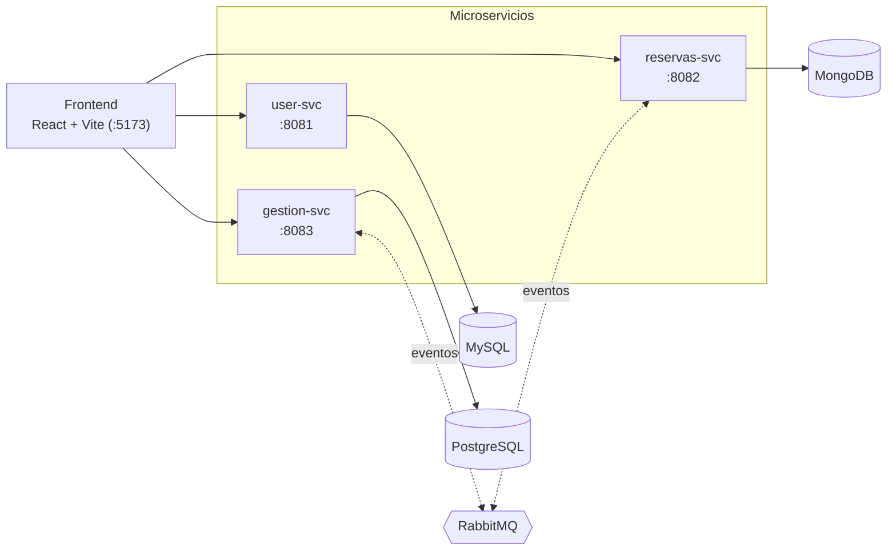

# tp-2025 · Plataforma de Gestión Hotelera


Trabajo práctico de la cátedra **Desarrollo de Aplicaciones para Negocios (DAN) — FRSF-UTN, 2025**.

Es un monorepo con una arquitectura de microservicios para la gestión de una cadena hotelera: alta de usuarios, administración de hoteles/habitaciones y ciclo de vida de reservas, comunicados de forma asíncrona vía RabbitMQ.

## Tabla de contenidos

- [Arquitectura](#arquitectura)
- [Stack tecnológico](#stack-tecnológico)
- [Estructura del repositorio](#estructura-del-repositorio)
- [Requisitos previos](#requisitos-previos)
- [Puesta en marcha rápida](#puesta-en-marcha-rápida)
- [Servicios](#servicios)
- [Desarrollo de un servicio individual](#desarrollo-de-un-servicio-individual)
- [Tests](#tests)
- [Consolas de administración](#consolas-de-administración)
- [Documentación del TP](#documentación-del-tp)
- [Licencia](#licencia)

## Arquitectura



`gestion-svc` y `reservas-svc` comparten contratos de eventos/DTOs a través de la librería `common/dan-common-lib`.

## Stack tecnológico

| Capa              | Tecnologías                                                         |
| ----------------- | ------------------------------------------------------------------- |
| Backend           | Java 21, Spring Boot 3.5, Spring Data (JPA / JDBC / MongoDB), Maven |
| Mensajería        | RabbitMQ (AMQP)                                                     |
| Persistencia      | MySQL · PostgreSQL · MongoDB                                        |
| Documentación API | springdoc-openapi (Swagger UI)                                      |
| Frontend          | React 19, TypeScript, Vite, TailwindCSS                             |
| Infraestructura   | Docker & Docker Compose                                             |
| Testing           | JUnit 5, Testcontainers (backend) · Vitest, Playwright (frontend)   |

## Estructura del repositorio

```
tp-2025/
├── common/dan-common-lib/     # DTOs y eventos compartidos entre gestion-svc y reservas-svc
├── services/
│   ├── user-svc/              # Usuarios, tarjetas de crédito, bancos       → MySQL
│   ├── gestion-svc/           # Hoteles, habitaciones, tipos, tarifas      → PostgreSQL
│   └── reservas-svc/          # Disponibilidad y reservas                  → MongoDB
├── frontend/                  # Panel React para probar los 3 microservicios
├── infra/                     # docker-compose.yml y config de infraestructura
├── postman/                   # Colecciones Postman por etapa del TP
├── ETAPA01.md / ETAPA02.md    # Consignas del trabajo práctico
└── DOCUMENTACION_DESARROLLO.md
```

## Requisitos previos

| Categoría                | Herramienta                                                                           | Notas                                                      |
| ------------------------ | ------------------------------------------------------------------------------------- | ---------------------------------------------------------- |
| IDE                      | [VSCode](https://code.visualstudio.com/)                                              | Recomendado para backend y frontend                        |
| IDE (frontend, opcional) | [Brackets](https://brackets.io/) / [Phoenix Code](https://phcode.dev/)                | Alternativas livianas para frontend                        |
| Backend                  | [Java 21 (Temurin)](https://adoptium.net/es/temurin/releases/?version=21&package=jdk) | Requerido para compilar y correr los servicios             |
| Backend                  | [Docker Desktop](https://docs.docker.com/desktop/)                                    | Levanta la infraestructura y los servicios containerizados |
| Frontend                 | [Node 22](https://nodejs.org/es/download)                                             | Ver versión exacta en [`.nvmrc`](.nvmrc)                   |
| Control de versiones     | [Git](https://git-scm.com/) + cuenta de [GitHub](https://github.com/)                 | —                                                          |

## Puesta en marcha rápida

1. **Compilar el backend** (genera los `.jar` que consume Docker):

   ```bash
   ./mvnw clean install -DskipTests
   ```

2. **Levantar infraestructura + microservicios**:

   ```bash
   docker compose -f infra/docker-compose.yml up -d --build
   ```

   Para levantar solo una parte, por ejemplo MySQL + phpMyAdmin:

   ```bash
   docker compose -f infra/docker-compose.yml up -d mysql phpmyadmin
   ```

   Para bajar todo (agregando `-v` también se borran los volúmenes/datos):

   ```bash
   docker compose -f infra/docker-compose.yml down [-v]
   ```

3. **Levantar el frontend** (con el backend ya corriendo):

   ```bash
   cd frontend
   npm install
   npm run dev
   ```

   Por defecto apunta a `localhost:8081/8082/8083`; las URLs son configurables en `frontend/.env`.

## Servicios

| Servicio       | Puerto | Base de datos | Responsabilidad                                                | Swagger UI                            |
| -------------- | :----: | ------------- | -------------------------------------------------------------- | ------------------------------------- |
| `user-svc`     |  8081  | MySQL         | Usuarios (huéspedes/propietarios), tarjetas de crédito, bancos | http://localhost:8081/swagger-ui.html |
| `gestion-svc`  |  8083  | PostgreSQL    | Hoteles, habitaciones, tipos de habitación, tarifas            | http://localhost:8083/swagger-ui.html |
| `reservas-svc` |  8082  | MongoDB       | Búsqueda de disponibilidad y gestión de reservas               | http://localhost:8082/swagger-ui.html |

## Desarrollo de un servicio individual

Para trabajar sobre un servicio en modo desarrollo (hot reload) en vez de dentro de Docker, con la infra correspondiente ya levantada:

```bash
cd services/user-svc
./mvnw spring-boot:run -DskipTests -Dspring-boot.run.profiles=local
```

El perfil `local` usa `application-local.properties`, que apunta a `localhost` en lugar de a los hostnames internos de la red de Docker.

## Tests

```bash
# Backend (por módulo o desde la raíz)
./mvnw test

# Frontend
cd frontend
npm test          # unitarios (Vitest)
npm run test:e2e  # end-to-end (Playwright)
```

## Consolas de administración

Disponibles una vez levantada la infra con Docker Compose:

| Consola              | URL                    | Credenciales                                |
| -------------------- | ---------------------- | ------------------------------------------- |
| phpMyAdmin (MySQL)   | http://localhost:6080  | `usr_app` / `usrapp` (o `root` / `rootpwd`) |
| pgAdmin (PostgreSQL) | http://localhost:6081  | `admin@admin.com` / `admin`                 |
| mongo-express        | http://localhost:6091  | —                                           |
| RabbitMQ Management  | http://localhost:15672 | `admin` / `admin`                           |

## Documentación del TP

- **Etapa 1** — Consigna: [`ETAPA01.md`](./ETAPA01.md) · ejemplos de uso: [`ETAPA01_CURLS.md`](./ETAPA01_CURLS.md)
- **Etapa 2** — Consigna: [`ETAPA02.md`](./ETAPA02.md) · guía paso a paso: [`PRACTICA_02.pdf`](PRACTICA_02.pdf) · enunciado completo: [`TP_PARTE_02.pdf`](TP_PARTE_02.pdf)
- **Documentación de desarrollo**: [`DOCUMENTACION_DESARROLLO.md`](./DOCUMENTACION_DESARROLLO.md)
- **Colecciones Postman**: [`postman/`](./postman)

## Licencia

Distribuido bajo licencia [MIT](./LICENSE).
